```mermaid
graph TD
    A@{ shape: processes, label: "⚙️ ASP.NET App Pod" }
    B@{ shape: hex, label: "📤 stdout / stderr" }
    C@{ shape: hex, label: "📄 Container Runtime Logs\n/var/log/pods" }

    D@{ shape: processes, label: "🧲 Grafana Alloy (DaemonSet)" }
    E@{ shape: hex, label: "🚪 Loki Gateway (Service)" }

    F@{ shape: processes, label: "📝 Loki Write Pods" }
    G@{ shape: processes, label: "📚 Loki Backend / Compactor" }

    H@{ shape: database, label: "🪣 Central MinIO Cluster\n(S3 Object Storage)" }

    A --> B
    B --> C
    C --> D
    D -->|push logs| E
    E --> F
    F --> G
    G -->|chunks + index| H
```

# 💭 Proposed Logging Architecture

```mermaid
flowchart LR
    A[⚙️ Application Pods<br/>stdout logs]
    B[🧲 Grafana Alloy<br/>DaemonSet]
    C[📚 Grafana Loki<br/>per AKS cluster]
    D[🪣 MinIO<br/>Shared S3 Storage]

    A --> B
    B --> C
    C --> D
```

---

> As part of the proof of concept, I suggest that **each AKS application cluster**  
> (e.g., **ELZ‑BSS‑PROD‑AKS**, **ELZ‑BSS‑PREPROD‑AKS**, …)  
> will deploy its **own in‑cluster logging stack** consisting of:
>
> - **Grafana Alloy** (node-level log collector)
> - **Grafana Loki** (log ingestion, indexing, and querying)
>
> These components form a **user‑managed observability data plane**,  
> **not part of the Kubernetes control plane**.

All clusters will forward their logs to a **shared, centralized MinIO object storage cluster**, which acts as the **durable backend** for Loki.

To ensure strong isolation and clean multi‑cluster boundaries:

- MinIO will run in a **separate infrastructure cluster**
- Each AKS cluster will receive its **own MinIO tenant/bucket + IAM policy**
- No application cluster will host its own MinIO instance

This avoids duplication, simplifies operations, and aligns with enterprise storage best practices.

---

## 🧩 **High-Level Logging Flow**

Applications **never interact with MinIO directly**.

They simply log to **stdout**, and the platform handles the rest:

1. App writes logs → **stdout/stderr**
2. Kubernetes writes container logs → **node filesystem**
3. **Grafana Alloy** tails logs and ships them
4. **Grafana Loki** ingests, indexes, and compacts logs
5. **MinIO** stores log chunks and indexes as durable S3 objects

---

---

---

## 🟢 **Why This Architecture?**

### ✔ One logging stack per AKS cluster

- Each cluster is **self-contained**
- No cross-cluster dependencies for log ingestion
- Easier troubleshooting and isolation

### ✔ One centralized MinIO cluster

- No need to deploy MinIO repeatedly
- Lower operational overhead
- Strong isolation via **tenants, buckets, and IAM policies**
- Centralized backup, DR, and lifecycle management

### ✔ Clean multi-cluster boundaries

Each cluster has:

- Its **own Alloy**
- Its **own Loki**
- Its **own MinIO bucket/tenant**
- But **shares the same MinIO infrastructure**

This is the recommended enterprise pattern for multi-cluster observability.

---

## 🧱 **Proof of Concept Scope**

We will deploy the logging stack into:

- **ELZ‑BSS‑PROD‑AKS**
- **ELZ‑BSS‑PREPROD‑AKS**
- Additional clusters as needed

Each cluster will:

- Deploy **Loki (Simple Scalable mode)**
- Deploy **Alloy (DaemonSet)**
- Connect to **its dedicated MinIO bucket/tenant**

The MinIO cluster will be deployed **once**, in a **separate infrastructure cluster**, and exposed securely to all AKS clusters.

---

## 💰 Production Sizing (Minimum Heavy-Load Baseline)

### Per **application AKS cluster**

| Component    | Minimum    |
| ------------ | ---------- |
| Alloy        | 1 per node |
| Loki write   | 3 replicas |
| Loki read    | 3 replicas |
| Loki backend | 2 replicas |

### Shared **MinIO**

| Item            | Minimum           |
| --------------- | ----------------- |
| Pods            | 4                 |
| Volumes per pod | 2                 |
| Disk            | ≥ 1 TB per volume |
| RAM             | 8–16 GB per pod   |

---

## 📄 Next Documents

i explained implementation each layer in separate documents.

- 🧲 **Logging Layer (Alloy + Loki)**
  → [`logging-layer/README.md`](./logging-layer/README.md)

- 🪣 **Object Storage Layer (MinIO)**
  → [`object-storage-layer/README.md`](./object-storage-layer/README.md)

---

## 📚 References that i used

- [Grafana Alloy Docs](https://grafana.com/docs/alloy/latest/)
- [Grafana Loki Docs](https://grafana.com/docs/loki/latest/)
- [Medium - Object Storage in your Kubernetes cluster using MinIO](https://medium.com/@martin.hodges/object-storage-in-your-kubernetes-cluster-using-minio-ad838decd9ce)
- [Medium - How to install MinIO in Kubernetes in 15 min.](https://dev.to/giveitatry/how-to-install-minio-in-kubernetes-in-15-min-47h9)

and For sure I used LLM Models like ChatGPT for documentation and searching.

