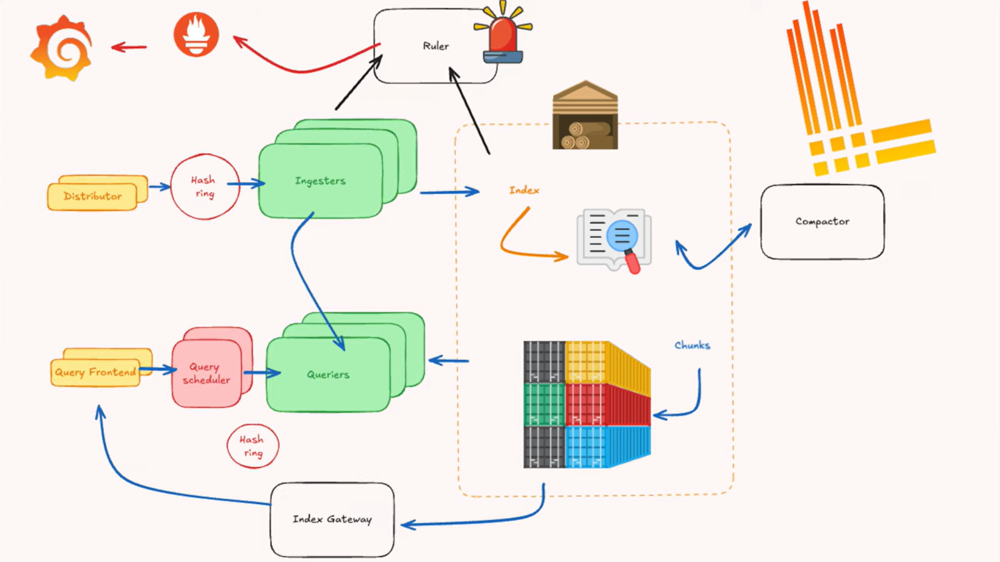

# 🧠 Production Logging Architecture (AKS)

> Each **application AKS cluster** runs its own **Loki + Alloy**.  
> All clusters write to a **shared MinIO S3 platform** using **bucket isolation**.




---

## 🔩 Components CREATED in **EACH application AKS cluster**

| Layer       | Kubernetes Objects                      |
| ----------- | --------------------------------------- |
| Log Agent   | `DaemonSet` (Grafana Alloy)             |
| Log Backend | `Deployments` (Loki write/read/backend) |
| Entry Point | `Service` (Loki Gateway – ClusterIP)    |
| Config      | `ConfigMap` (Alloy + Loki config)       |
| Secrets     | `Secret` (MinIO credentials)            |
| Storage     | **External MinIO (S3)**                 |
| Retention   | Loki Compactor                          |

---

## 📦 Prerequisites (Production Mandatory)

- AKS with **multiple node pools**
- Logging node pool recommended (optional but common)
- Shared **MinIO cluster** already running
- One **bucket per AKS cluster**
- TLS enabled on MinIO endpoint

Example bucket:

```ini
loki-prod-aks-a
```

---

## 1️⃣ Prepare MinIO (ONE TIME per cluster)

### 1. Create bucket

```bash
mc mb minio/loki-prod-aks-a
```

### 2. Create user + policy

Policy example:

```json
{
  "Version": "2012-10-17",
  "Statement": [
    {
      "Effect": "Allow",
      "Action": ["s3:*"],
      "Resource": ["arn:aws:s3:::loki-prod-aks-a", "arn:aws:s3:::loki-prod-aks-a/*"]
    }
  ]
}
```

You will give each AKS cluster:

- `S3_ENDPOINT`
- `BUCKET`
- `ACCESS_KEY`
- `SECRET_KEY`

---

## 2️⃣ Install Grafana Loki (Production / Heavy Load)

We use **Simple Scalable mode** (recommended up to very high scale).

### Add Helm repo

```bash
helm repo add grafana https://grafana.github.io/helm-charts
helm repo update
kubectl create ns logging
```

---

## 🔧 Loki production values (`values-loki.yaml`)

```yaml
deploymentMode: SimpleScalable

loki:
  auth_enabled: false

minio:
  enabled: false # IMPORTANT: external MinIO

# Heavy-load baseline
write:
  replicas: 3
read:
  replicas: 3
backend:
  replicas: 2

resources:
  requests:
    cpu: "1"
    memory: "2Gi"
  limits:
    cpu: "2"
    memory: "4Gi"

lokiConfig:
  common:
    replication_factor: 3
    path_prefix: /var/loki

  schema_config:
    configs:
      - from: "2025-01-01"
        store: tsdb
        object_store: s3
        schema: v13
        index:
          prefix: loki_index_
          period: 24h # REQUIRED for retention

  storage_config:
    aws:
      s3: https://minio.internal.company:9000
      bucketnames: loki-prod-aks-a
      access_key_id: ${MINIO_ACCESS_KEY}
      secret_access_key: ${MINIO_SECRET_KEY}
      s3forcepathstyle: true
      insecure: false

  compactor:
    working_directory: /var/loki/compactor
    retention_enabled: true
    delete_request_store: s3

  limits_config:
    retention_period: 336h # 14 days
    ingestion_rate_mb: 50
    ingestion_burst_size_mb: 100
```

---

### Create secret for MinIO credentials

```bash
kubectl create secret generic minio-credentials \
  -n logging \
  --from-literal=MINIO_ACCESS_KEY=xxxxx \
  --from-literal=MINIO_SECRET_KEY=yyyyy
```

---

### Install Loki

```bash
helm upgrade --install loki grafana/loki \
  -n logging \
  -f values-loki.yaml \
  --set envFrom[0].secretRef.name=minio-credentials
```

---

## 3️⃣ Install Grafana Alloy (Log Agent)

Grafana Alloy replaces Promtail.

### Alloy runs as **DaemonSet**

- One pod per node
- Automatically scales with node count

---

## 🔧 Alloy production config (`values-alloy.yaml`)

```yaml
controller:
  type: daemonset

alloy:
  configMap:
    content: |
      logging {
        level = "info"
      }

      loki.source.kubernetes "pods" {}

      loki.process "enrich" {
        forward_to = [loki.write.default.receiver]

        stage.json {
          expressions = {
            level = "Level",
            message = "Message"
          }
        }

        stage.labels {
          values = {
            cluster = "aks-prod-a",
            env     = "prod"
          }
        }
      }

      loki.write "default" {
        endpoint {
          url = "http://loki-gateway.logging.svc.cluster.local/loki/api/v1/push"
        }
      }
```

---

### Install Alloy

```bash
helm upgrade --install alloy grafana/alloy \
  -n logging \
  -f values-alloy.yaml
```
