```mermaid
graph TD
    A@{ shape: hex, label: "📦 Clients\n(Loki, Apps, Backups)" }
    B@{ shape: hex, label: "🌐 Internal LoadBalancer\nS3 Endpoint" }

    subgraph AKS["AKS Cluster"]
      C@{ shape: processes, label: "🧠 MinIO Operator\n(Control Plane)" }

      subgraph Tenant["🪣 MinIO Tenant (Data Plane)"]
        D1@{ shape: processes, label: "⚙️ MinIO Pod 0" }
        D2@{ shape: processes, label: "⚙️ MinIO Pod 1" }
        D3@{ shape: processes, label: "⚙️ MinIO Pod 2" }
        D4@{ shape: processes, label: "⚙️ MinIO Pod 3" }

        V1[(💽 PVC / Azure Disk)]
        V2[(💽 PVC / Azure Disk)]
        V3[(💽 PVC / Azure Disk)]
        V4[(💽 PVC / Azure Disk)]
      end
    end

    A --> B
    B --> D1
    B --> D2
    B --> D3
    B --> D4

    D1 --- V1
    D2 --- V2
    D3 --- V3
    D4 --- V4
```

# 🧠 **MinIO Object Storage Internals (AKS)**

> **MinIO** provides **S3-compatible object storage** for Kubernetes workloads.
> In AKS, MinIO is deployed as a **stateful distributed system**, managed via Kubernetes primitives.
>
> MinIO is composed of:
>
> - **MinIO Operator** → lifecycle and control
> - **MinIO Tenant** → the actual S3-compatible storage cluster
>
> Consumers (Loki, backups, CI/CD, data platforms) **access MinIO only via the S3 API**, never via PVCs.

---

<div align="center" style="background-color: #2b3436ff; border-radius: 10px; border: 2px solid">



</div>

---

## ⚙️ **Core Components (What Gets Created)**

### 1️⃣ **MinIO Operator (Control Plane)**

**Role:**

- Kubernetes **controller**
- Manages MinIO lifecycle (create, scale, upgrade)
- **Does not store any data**

**Kubernetes objects created:**

| Object       | Type             | Purpose                    |
| ------------ | ---------------- | -------------------------- |
| Operator Pod | Deployment       | Reconciles MinIO resources |
| CRDs         | CRD              | `Tenant`, `Bucket`, `User` |
| RBAC         | Roles / Bindings | Cluster permissions        |
| Namespace    | Namespace        | Isolation                  |

> **Operator = orchestration only**

---

### 2️⃣ **MinIO Tenant (Data Plane)**

**Role:**

> A **distributed MinIO cluster** that exposes an **S3-compatible API**.

**Kubernetes objects created:**

| Component        | Type                   | Purpose                      |
| ---------------- | ---------------------- | ---------------------------- |
| MinIO Pods       | StatefulSet            | Stable identity and ordering |
| PVCs             | PersistentVolumeClaim  | Durable object storage       |
| Headless Service | Service                | Pod discovery                |
| S3 Service       | Service (LoadBalancer) | Client access                |
| Console Service  | Service                | Admin access                 |
| Secrets          | Secret                 | Root and service credentials |

---

### 3️⃣ **Persistent Storage (Azure Managed Disks)**

- Each MinIO pod mounts **multiple independent disks**
- One PVC per disk
- Backed by:

  - Premium SSD v2 (default)
  - Ultra Disk (high throughput cases)

Example layout:

```text
4 pods × 2 volumes = 8 PVCs
```

This layout is required for **erasure coding** and parallel IO.

---

### 4️⃣ **S3 Endpoint Exposure**

- Exposed via:

  - `Service: LoadBalancer` (internal only)

- Access pattern:

```text
https://minio.internal.company:9000
```

- No access via ClusterIP
- No PVC access by consumers

---

## 📦 **Prerequisites (Production Mandatory)**

- AKS cluster with **multiple nodes**
- Dedicated node pool recommended
- Azure Managed Disks (Premium SSD v2 or better)
- Private networking (no public endpoint)
- Monitoring for disk health and quorum

---

## 🛠️ **Deployment Options**

## OPTION 🅰️ Install MinIO in an Existing AKS Cluster

⚠️ Suitable for:

- Non-prod
- Shared infra clusters
- Small / medium workloads

---

### Step 1️⃣ Create namespace

```bash
kubectl create namespace minio
```

---

### Step 2️⃣ Install MinIO Operator

```bash
kubectl apply -k github.com/minio/operator?ref=v6.0.4
```

Verify:

```bash
kubectl get pods -n minio-operator
```

---

### Step 3️⃣ Create StorageClass (Premium SSD v2)

```yaml
apiVersion: storage.k8s.io/v1
kind: StorageClass
metadata:
  name: minio-premium
provisioner: disk.csi.azure.com
parameters:
  skuName: PremiumV2_LRS
reclaimPolicy: Retain
volumeBindingMode: WaitForFirstConsumer
```

Apply:

```bash
kubectl apply -f storageclass.yaml
```

---

### Step 4️⃣ Create MinIO Tenant (minimum prod-safe)

```yaml
apiVersion: minio.min.io/v2
kind: Tenant
metadata:
  name: minio-prod
  namespace: minio
spec:
  pools:
    - servers: 4
      volumesPerServer: 2
      volumeClaimTemplate:
        spec:
          storageClassName: minio-premium
          accessModes: [ReadWriteOnce]
          resources:
            requests:
              storage: 1Ti
```

Apply:

```bash
kubectl apply -f tenant.yaml
```

---

### Step 5️⃣ Validate services

```bash
kubectl get svc -n minio
```

Ensure:

- S3 service is **internal LoadBalancer**
- No public exposure

---

## OPTION 🅱️ Install MinIO in a Dedicated AKS Cluster (RECOMMENDED)

✅ Preferred for **production and shared storage platforms**

---

### Step 0️⃣ Create AKS cluster

```bash
az aks create \
  --resource-group rg-minio-prod \
  --name aks-minio-prod \
  --node-count 4 \
  --node-vm-size Standard_D8s_v5 \
  --enable-managed-identity \
  --enable-oidc-issuer \
  --network-plugin azure \
  --zones 1 2 3
```

---

### Step 1️⃣ Add dedicated storage node pool

```bash
az aks nodepool add \
  --resource-group rg-minio-prod \
  --cluster-name aks-minio-prod \
  --name minionp \
  --node-count 4 \
  --node-vm-size Standard_D8s_v5 \
  --zones 1 2 3 \
  --labels nodepool=minio \
  --node-taints storage=minio:NoSchedule
```

---

### Step 2️⃣ Install MinIO Operator.

```bash
kubectl apply -k github.com/minio/operator?ref=v6.0.4
```

---

### Step 3️⃣ Enforce node affinity (Tenant spec)

```yaml
affinity:
  nodeAffinity:
    requiredDuringSchedulingIgnoredDuringExecution:
      nodeSelectorTerms:
        - matchExpressions:
            - key: nodepool
              operator: In
              values:
                - minio
```

This guarantees:

- Storage isolation
- No noisy neighbors

---

### Step 4️⃣ Networking

- Internal LoadBalancer
- Private DNS
- VNET peering to application AKS clusters

---

## 🔐 **Production Guardrails**

| Area        | Requirement          |
| ----------- | -------------------- |
| Pods        | ≥ 4                  |
| Volumes     | ≥ 2 per pod          |
| Disks       | Managed, expandable  |
| Network     | Private only         |
| Buckets     | One per consumer     |
| Credentials | Per bucket           |
| Monitoring  | Disk health + quorum |
| Scaling     | Planned, not HPA     |
